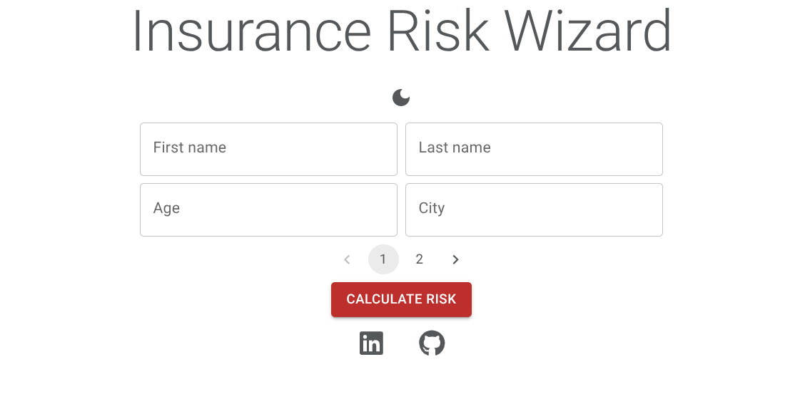
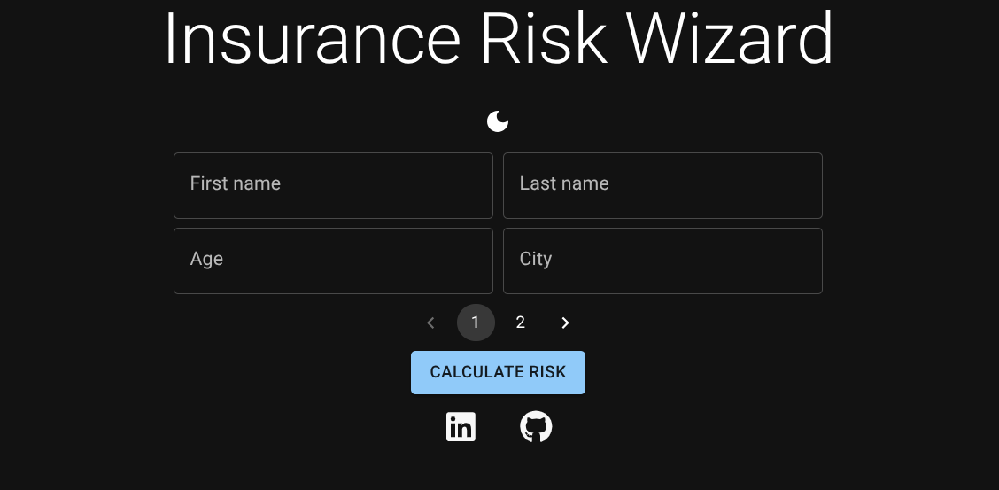
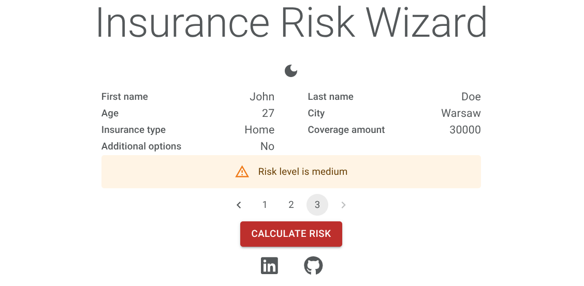

# Insurance Risk Wizard - Frontend

Wizard for insurance risk level calculation

## 🌟 Highlights

- 🌙 Dark mode with system preference awareness
- ✨ Clean and simple
- 📱Responsive design for mobile and desktop

## 💻 Technologies used

-  **Typescript** for the programming language
-  **React** for the UI framework
-  **MaterialUI** for the React component library
-  **Vite** for the build system
- 📋 **React Hook Forms** for the form validation
-  **Jenkins** for CI/CD
-  **Docker** for CI/CD
-  **GitHub Actions** for automatic linting with eslint and code formatting with prettier (CI/CD)
-  **Zod** for form validation

## 👉 Try it!

Self hosted here: [irw.mysliwczykrafal.pl](https://irw.mysliwczykrafal.pl)

## 📥 Deployment

For the API url in .env, you can use my api: https://irw-api.mysliwczykrafal.pl
If you'd like to create your own. Check the API docs here [https://irw-api.mysliwczykrafal.pl/docs](https://irw-api.mysliwczykrafal.pl/docs)
If you wish to deploy the app yourself follow these steps:

- Install [Docker](https://docs.docker.com/engine/install/) or [Podman](https://podman.io/docs/installation). If you use Podman, replace `docker` command with `podman` in the following steps.
- `git clone` the repository or download and extract the .zip with the source code.
- `cd /directory/with/the/sourcecode`
- `mv .env.example .env`
- Make sure to edit the default variables values in .env
- `docker build -t "irw-frontend" .`
- `docker run -d --rm --name "irw-frontend" -p 8000:8000 "irw-frontend"`
- Visit `http://127.0.0.1:8000` to access main page

## 📝 Project details

Description of work organization and demo deployment details

No AI was used for the code or documentation of this project. I'm not opposed to using AI tools in the right context, but for the purpose of my personal portfolio projects I've decided not to use them.

### Tools and resources

#### Project management

-  **Git** for version control
-  **UML** for Use case diagram
-  **Jira** for tracking tasks

#### Deployment

-  Local homelab server running **Debian Linux**
- 🌎 **Dynamic DNS** with [Dynu](https://www.dynu.com) for hosting with dynamic IP
-  **NGINX** for reverse proxy
-  **GitHub webhook** for triggering Jenkins build and deployment
- 🌐 **HTTPS** with certbot and Let's Encrypt

## 📸 Screenshots

  

